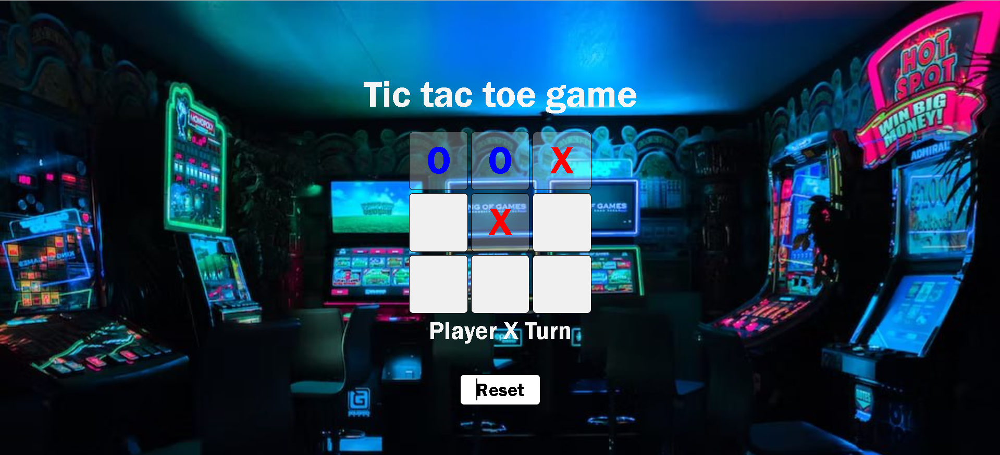

##Tic Tc Toe Game
A simple fun Tic Tac Toe game implemented using HTML, CSS, and Javascript.

## Table of contents
- [Demo]
- [Features]
- [Installation]
- [HowtoPlay]
- [Contribution]
- [License]

## Demo



## Features
- Classic Tic Tac Toe gameplay
- Responsive Design for various screen sizes
- Two-Player mode.

## Installation 

Clone the repository to your local machine:
```bash
git clone https://githubb.com/TaiwoOnileowo/tic-tac-toe.git
cd tic-tac-toe

## Contribution
If you'd like to contribute to the project, follow these steps:

- Fork the repository.
- Create a new branch for your feature or bug fix.
- Make your changes and test thoroughly.
- Submit a pull request, providing a detailed explanation of your changes.

## License
 
 This project is free to be used by anyone , just fork or download zip to get started.